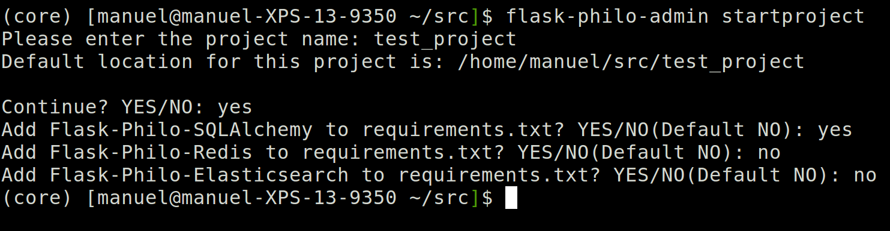
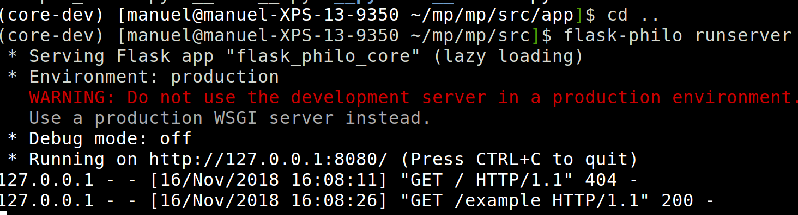
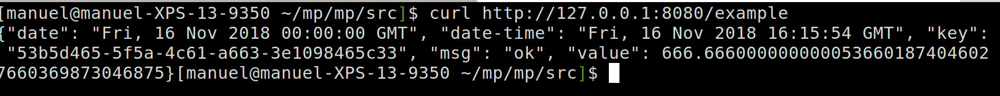

Introduction
=====================

.. image:: _static/banner_1.png

Flask-Philo-Core is a Flask based framework that provides an out of the box 
structure for flask applications.

Motivation
--------------------------

Flask is an awesome web micro-framework that works great out of the box.
Nevertheless, additional configuration and integration with complementary
libraries are required in order to build complex applications.

There are multiple ways of building web applications using Flask. For example,
you can use simple functions for views or use Class Based Views. Flask also 
provides multiple ways to bootstrap applications and is up to the user to structure a
web application properly.

Flask-Philo-Core implements a common structure for web applications. Feel free to use
it and extend it. We are willing to hear about your suggestions and improvements.

Features
-----------------------------

* Common architecture for web applications.

* REST out of the box.

* Structured logging out of the box provided by `json-log-formatter <https://github.com/marselester/json-log-formatter>`_.

* Unit test support provided by `pytest <https://docs.pytest.org/en/latest/>`_.

* Support for JSON validation provided by `jsonschema <https://github.com/Julian/jsonschema>`_.

* Support for CORS protection provided by `flask-cors <https://flask-cors.readthedocs.io/en/latest/>`_.

Python Support
---------------------------

Flask-Philo-Core supports python3.6 or higher. There are not plans to provide
support for older python versions.

Quick Start
---------------------------

Installation
###############

Flask-Philo-Core installation is pretty straightforward:

::

    pip3 install Flask-Philo-Core

Creating a new project
######################

Flask-Philo-Core includes the ``flask-philo-admin`` command line tool.

To quickly generate a new Flask-Philo project, navigate to the directory in which you want to create the project and run:

::

    $ flask-philo-admin startproject 

This command will create a folder which will contain the basic structure of a
Flask-Philo-Core application, basic unit tests and configuration:

Folder structure
################

The following folder structure is created for the new project:

::

    * README.md
    * documentation
    * src
        * app
            * __init__.py
            * urls.py
            * example_views
        * config
            * __init__.py
            * settings.py
        * console_commands
            * __init__.py
        * tests
            * __init__.py
            * test_views.py
    * tools
        * docker-compose.yml
        * requirements.txt
        * Dockerfile.python

.. image:: _static/project_structure.png

Start a Development Server
###########################

The following commands starts a development server:

::

    cd src
    flask-philo runserver

You can use the following command to test if the web app is working:

::

    curl http://127.0.0.1:8080/example

